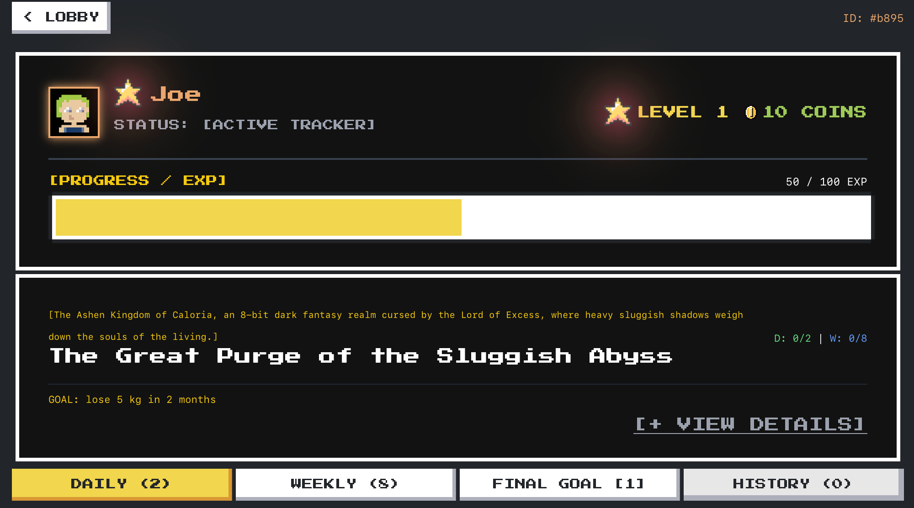
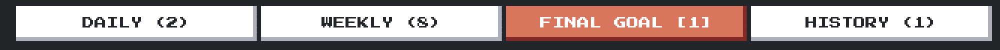
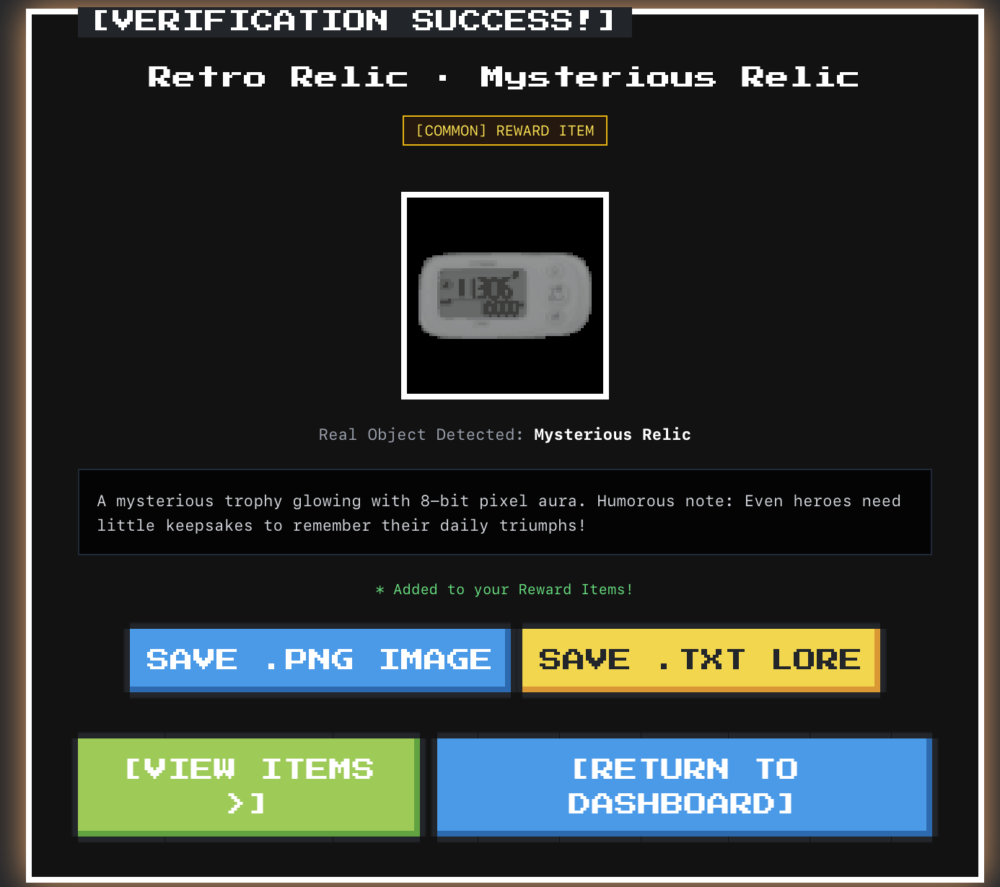
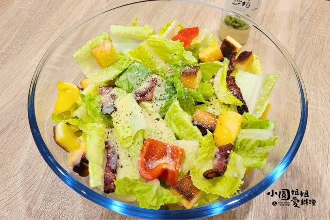
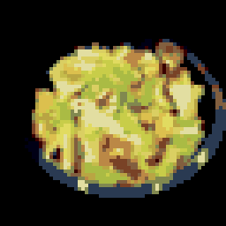

<div align="center">

```
+--------------------------------------------------------------+
|                                                              |
|   GGGGGG   AAAAA   M   M  III  FFFFF  Y   Y                 |
|   G       A   A   MM MM   I   F       Y Y                  |
|   G  GG   AAAAA   M M M   I   FFFF     Y                   |
|   G   G   A   A   M   M   I   F        Y                   |
|   GGGGG   A   A   M   M  III  F        Y                   |
|                                                              |
|   EEEEE  V   V  EEEEE  RRRR   Y   Y  TTTTT  H   H  III  N   |
|   E       V V   E      R   R   Y Y     T    H   H   I   NN  |
|   EEEE     V    EEEE   RRRR     Y      T    HHHHH   I   N N |
|   E        V    E      R  R     Y      T    H   H   I   N  N|
|   EEEEE    V    EEEEE  R   R    Y      T    H   H  III  N   N|
|                                                              |
+--------------------------------------------------------------+
```

# 🎮 Gamify Everything

### *Turn Real-Life Goals into an 8-Bit Retro Pixel Adventure*
### *将现实生活目标转化为 8-bit 复古像素 RPG 打卡与收集游戏*

**Powered by Google Gemini AI — Built for Google AI Hackathon 2026**

<br/>

[](https://gamify-frontend-943810940065.us-central1.run.app)
[](https://gamify-backend-943810940065.us-central1.run.app/docs)
[](./slides.html)
[](https://nextjs.org/)
[](https://fastapi.tiangolo.com/)
[](https://aistudio.google.com/)

</div>

---

<p align="center">
  <a href="#-english">🌐 English</a> &nbsp;|&nbsp;
  <a href="#-简体中文">🌐 简体中文</a> &nbsp;|&nbsp;
  <a href="#-quickstart">🚀 Quickstart</a> &nbsp;|&nbsp;
  <a href="#-interactive-slides">🕹️ Slides</a>
</p>

---

<a name="-english"></a>

## 🌟 English

### 💡 What is Gamify Everything?

**Gamify Everything** bridges the gap between vague personal aspirations and structured daily execution. Instead of boring to-do lists that you abandon after two weeks, it leverages **Google Gemini AI** to transform your real-life goals into an immersive **8-bit RPG adventure** — with AI-powered photo verification, experience points, boss raids, and a unique twist: your real-world check-in photos are transmuted into permanent **pixel art souvenirs** you can collect forever.

> 🧠 **Powered by Google's Latest AI Stack** — We harness the full power of **Gemini 3.0 Pro** and **Gemini 2.5 Flash** working in concert: Pro's chain-of-thought reasoning decomposes vague natural-language goals into rigorously structured JSON campaign blueprints, while Flash's native vision-language understanding verifies real-world photo proof, identifies objects, and even writes witty RPG item lore — all from a single multimodal model. **Text in, pixels out. No separate OCR. No separate classifier. One model, end-to-end multimodality.**

<p align="center">
  
  <br/>
  <em>⬆️ Campaign Lobby — manage your gamified goals with retro 8-bit aesthetic</em>
</p>

---

### ✨ Key Features

> 🧠 **Two Gemini Models, One Unified AI Pipeline** — From natural-language goal decomposition to vision-language photo verification to creative RPG lore generation, every AI-powered step runs on Google's latest Gemini model family. We take full advantage of Gemini's native **multimodality**: the same Flash model that verifies your gym selfie also detects what object you're holding *and* writes a witty fantasy description for it — no model-switching, no glue code.

<table>
<tr>
<td width="50%">

#### 🎯 AI Goal Decomposition — `Gemini 3.0 Pro`
Automatically analyzes vague life aspirations (e.g., *"Lose 5kg in 2 months"* or *"Learn Python daily"*) and breaks them into a structured hierarchy through chain-of-thought reasoning:
- **Daily Quests** — bite-sized micro-habits (2-3 per campaign)
- **Weekly Milestones** — numeric checkpoint verifications
- **Boss Raid** — the final outcome challenge with a legendary title reward

Everything generated as **strictly-typed Structured JSON** via Gemini's native JSON response mode — RPG world-building lore, quantitative target analysis, and per-quest proof verification prompts, all in a single API call.

<p align="center">
  
  <br/>
  <em>⬆️ Daily / Weekly / Boss three-tier quest system</em>
</p>

</td>
<td width="50%">

#### 📸 Multimodal Proof Verification — `Gemini 2.5 Flash`
Upload real-life proof photos (gym selfies, study desks, healthy meals). Gemini Flash's **native vision-language multimodality** analyzes the image and proof prompt together in **milliseconds** — no separate OCR, no external classifier — returning a structured verdict directly:

```
{
  "is_valid": true,
  "confidence": 0.98,
  "reason": "Clear photo of gym equipment...",
  "detected_main_object": "Dumbbell Set"
}
```

Even the **Free Upload / Synthesis** mode auto-approves any clear photo and crafts an 8-bit relic — no strict quest gates.

<p align="center">
  
  <br/>
  <em>⬆️ Upload a proof photo — AI verifies in real-time</em>
</p>

</td>
</tr>
</table>

#### 🎨 8-Bit Pixel Transmutation Pipeline

A non-blocking asynchronous computer vision pipeline transforms every verified check-in photo into a permanent, transparent **16-color NES-style pixel art artifact** stored in your inventory gallery.

<p align="center">
  
  &nbsp;&nbsp;⟶&nbsp;&nbsp;
  
  <br/>
  <em>⬆️ Real salad photo → AI background removal → 16-color pixelation → Permanent inventory relic</em>
</p>

```
[Real Photo] → [Gemini Flash Object Detection] → [Gemini Humorous RPG Lore + Rarity]
                                                              │
[Inventory Gallery] ← [Nearest-Neighbor 256×256] ← [pyxelate 64×64 Quantization] ← [rembg U2Net BG Removal]
```

Each item receives:
- A **retro RPG name** + **rarity tier** (Common / Rare / Epic / Legendary)
- A **humorous one-liner** connecting the object to real-life productivity
- **Acquisition date** (`YYYY-MM-DD`)
- **Downloadable** as `.png` pixel art or `.txt` lore card

#### ☁️ Cloud Native & Serverless

Fully dockerized and deployed on **Google Cloud Run** for automatic scaling and **zero cold-start latency**:
- Frontend: Next.js 16 standalone container
- Backend: FastAPI + **U2Net ONNX weights (170MB) pre-cached** in the Docker image layer
- CI/CD: Google Cloud Build multi-stage pipeline

---

### 🏛 System Architecture

```
┌─────────────────────────────────────────────────────────────────┐
│                       FRONTEND LAYER                             │
│   Next.js 16 · React 19 · NES.css 8-bit UI · Zustand + Persist  │
│   Google Cloud Run (Serverless, Auto-scaling)                   │
└────────────────────────────┬────────────────────────────────────┘
                             │  RESTful JSON API / CORS
                             ▼
┌─────────────────────────────────────────────────────────────────┐
│                       BACKEND LAYER                              │
│   Python FastAPI Async · SQLAlchemy 2.0 + aiosqlite             │
│   Google Cloud Run (2GB RAM, 2 CPU, CPU Boost)                  │
│   Dual State: In-Memory ↔ SQLite Persistent Sync                │
└──────┬──────────────────────┬──────────────────────┬────────────┘
       │                      │                      │
       ▼                      ▼                      ▼
┌──────────────┐  ┌──────────────────┐  ┌──────────────────────┐
│ Gemini 3.0   │  │ Gemini 2.5 Flash │  │ ONNXRuntime U2Net    │
│ Pro          │  │ Multimodal       │  │ + pyxelate 16-Color  │
│ Goal Decomp  │  │ Photo Verify     │  │ + Pillow Processing  │
└──────────────┘  └──────────────────┘  └──────────────────────┘
```

**REST API Endpoints:**

| Method | Endpoint | Description |
|--------|----------|-------------|
| `POST` | `/api/v1/quests/decompose` | AI goal decomposition → structured campaign JSON |
| `POST` | `/api/v1/proof/verify` | Multimodal photo verification + pixel item synthesis |
| `POST` | `/api/v1/players/sync` | Full player state persistence (cross-device) |
| `GET` | `/api/v1/players/{name_or_id}` | Reconstruct complete player profile from DB |
| `GET` | `/api/v1/player/{id}/state` | Quick player stats lookup |
| `GET` | `/api/v1/player/{id}/inventory` | Player's pixel item gallery |
| `GET` | `/api/v1/quests/active/{player_id}` | List incomplete quests |

---

### 🧰 Complete Tech Stack

<table>
<tr>
<th>Layer</th><th>Technology</th><th>Role</th>
</tr>
<tr>
<td rowspan="2"><strong>🧠 AI & LLM</strong></td>
<td><strong>Google Gemini 3.0 Pro</strong> (<code>gemini-pro-latest</code>)</td>
<td>Chain-of-thought goal decomposition, structured JSON campaign generation</td>
</tr>
<tr>
<td><strong>Google Gemini 2.5 Flash</strong> (<code>gemini-flash-latest</code>)</td>
<td>Multimodal vision verification, object detection, RPG lore writing</td>
</tr>
<tr>
<td rowspan="4"><strong>👁️ Computer Vision</strong></td>
<td><strong>rembg</strong> (U2Net ONNX)</td>
<td>Deep-learning salient object detection & background removal</td>
</tr>
<tr>
<td><strong>pyxelate</strong></td>
<td>Retro 8-bit downsampling with 16-color palette quantization</td>
</tr>
<tr>
<td><strong>onnxruntime</strong></td>
<td>High-performance C++ inference engine for U2Net</td>
</tr>
<tr>
<td><strong>Pillow (PIL)</strong></td>
<td>Bounding-box cropping, padding, RGBA alpha manipulation</td>
</tr>
<tr>
<td rowspan="6"><strong>💻 Frontend</strong></td>
<td><strong>Next.js 16</strong></td>
<td>React framework with App Router & standalone output</td>
</tr>
<tr>
<td><strong>React 19</strong></td>
<td>Latest declarative UI rendering</td>
</tr>
<tr>
<td><strong>NES.css</strong></td>
<td>Open-source 8-bit Nintendo-style retro CSS framework</td>
</tr>
<tr>
<td><strong>Tailwind CSS v4</strong></td>
<td>Utility-first atomic CSS engine</td>
</tr>
<tr>
<td><strong>Zustand</strong></td>
<td>Lightweight state management with localStorage persistence</td>
</tr>
<tr>
<td><strong>Lucide React</strong></td>
<td>Clean icon toolkit</td>
</tr>
<tr>
<td rowspan="5"><strong>⚙️ Backend</strong></td>
<td><strong>FastAPI</strong></td>
<td>Modern async Python web framework with auto OpenAPI docs</td>
</tr>
<tr>
<td><strong>Uvicorn</strong></td>
<td>High-performance ASGI server (uvloop + httptools)</td>
</tr>
<tr>
<td><strong>SQLAlchemy 2.0</strong></td>
<td>Async ORM with aiosqlite driver</td>
</tr>
<tr>
<td><strong>Pydantic v2</strong></td>
<td>Rust-powered data validation & serialization</td>
</tr>
<tr>
<td><strong>python-multipart</strong></td>
<td>Form-data file upload parsing</td>
</tr>
<tr>
<td rowspan="4"><strong>☁️ Cloud & DevOps</strong></td>
<td><strong>Google Cloud Run</strong></td>
<td>Fully-managed serverless container runtime</td>
</tr>
<tr>
<td><strong>Google Cloud Build</strong></td>
<td>Serverless CI/CD with multi-stage Docker builds</td>
</tr>
<tr>
<td><strong>Artifact Registry</strong></td>
<td>Secure production container image storage</td>
</tr>
<tr>
<td><strong>Docker</strong></td>
<td>Multi-stage builds ensuring dev/prod parity</td>
</tr>
</table>

---

### 🔮 The Pixel Transmutation — Step by Step

When you complete a task and upload a photo, here's exactly what happens:

| Step | Process | Technology | Output |
|:----:|---------|-----------|--------|
| **1** | **Photo Capture** — snap your morning water mug, salad bowl, gym equipment, or study desk | Device Camera | Raw JPEG/PNG |
| **2** | **AI Object Detection** — Gemini Flash scans the image, verifies quest completion, and identifies the single most prominent real-world subject | `gemini-flash-latest` | `"Sports Water Flask"` |
| **3** | **RPG Lore & Rarity** — AI generates an epic retro item name, assigns rarity (Common→Legendary), writes a typewriter-dialogue story, and appends a witty observation connecting the item to real life | `gemini-flash-latest` | `"Abyssal Hydration Vessel"` — *Rare* |
| **4** | **AI Background Removal** — U2Net deep neural network segments the primary object and deletes all background clutter, outputting clean transparent RGBA | `rembg` / ONNXRuntime | RGBA foreground only |
| **5** | **16-Color Pixelation** — pyxelate downsamples to 64×64 with retro color clustering into an authentic NES 16-color palette | `pyxelate` | 64×64 quantized pixel art |
| **6** | **Upscale & Store** — nearest-neighbor scaling preserves hard pixel edges at 256×256, saved as Base64 PNG in your permanent inventory | `Pillow` (NEAREST) | 256×256 PNG → Gallery |

---

### 🎮 User Journey

```
┌──────────┐    ┌───────────┐    ┌──────────────────┐    ┌──────────────┐
│ ONBOARD  │───▶│ SET GOAL  │───▶│ AI DECOMPOSITION │───▶│ DAILY QUESTS │
│ Name +   │    │ "Lose 5kg │    │ JSON Campaign    │    │ + Weekly     │
│ Avatar   │    │ in 2 mo." │    │ Blueprint        │    │ + Boss Raid  │
└──────────┘    └───────────┘    └──────────────────┘    └──────┬───────┘
       │                                                        │
       │    ┌───────────────────────────────────────────────────┘
       │    ▼
       │  ┌──────────────┐    ┌──────────────┐    ┌──────────────┐
       │  │ 📸 UPLOAD    │───▶│ 🤖 AI VERIFY │───▶│ ✅ LEVEL UP  │
       │  │ Proof Photo  │    │ Gemini Flash │    │ + XP + Coins│
       │  └──────────────┘    └──────┬───────┘    └──────┬───────┘
       │                             │                    │
       │                             ▼                    ▼
       │                    ┌────────────────────────────────────┐
       │                    │  🎨 6-STEP PIXEL TRANSMUTATION     │
       │                    │  rembg → pyxelate → 256×256 PNG    │
       │                    └────────────────┬───────────────────┘
       │                                     │
       ▼                                     ▼
┌─────────────────────────────────────────────────────────────────┐
│                    🎒 INVENTORY GALLERY                          │
│  Collect, inspect & download pixel artifacts with RPG lore!     │
└─────────────────────────────────────────────────────────────────┘
```

---

### 🕹️ Interactive Slides

We built a fully interactive, pixel-art themed **10-slide presentation deck** that you can view directly in your browser:

<p align="center">
  <a href="./slides.html">
    
  </a>
</p>

**Features:**
- 🎨 Press Start 2P pixel font + NES.css 8-bit styling
- ⌨️ Navigate with `← →` arrow keys
- 🖨️ Print-ready (`Ctrl+P` → Save as PDF)
- 📸 Includes app screenshots, architecture diagrams, and before/after pixel comparisons
- 📱 QR code link to the live demo

> 💡 **Tip:** Open `slides.html` in Chrome, press `Ctrl+P`, select "Save as PDF" — you'll get a pixel-perfect PDF slide deck!

---

<a name="-quickstart"></a>

### 🚀 Quickstart

#### Prerequisites
- **Node.js** 20+ & npm
- **Python** 3.11+
- **Google Gemini API Key** — [Get one free](https://aistudio.google.com/app/apikey)

#### 1. Backend Setup

```bash
cd backend
python -m venv venv
source venv/bin/activate      # Windows: venv\Scripts\activate
pip install -r requirements.txt

# Create environment file
echo 'GEMINI_API_KEY="your_api_key_here"' > .env
echo 'DATABASE_URL="sqlite+aiosqlite:///./gamify.db"' >> .env

# Start FastAPI dev server (port 8080)
uvicorn app.main:app --reload --port 8080
```

Open [http://localhost:8080/docs](http://localhost:8080/docs) for the interactive Swagger API documentation.

#### 2. Frontend Setup

```bash
cd frontend
npm install

# Start Next.js dev server (port 3000)
npm run dev
```

Open [http://localhost:3000](http://localhost:3000) and start your pixel adventure!

---

### 📡 Live Deployment

<p align="center">
  
  <br/>
  <em>Scan to try the live app!</em>
</p>

| Environment | URL |
|-------------|-----|
| 🎮 **Frontend** | [https://gamify-frontend-943810940065.us-central1.run.app](https://gamify-frontend-943810940065.us-central1.run.app) |
| 📡 **API Docs** | [https://gamify-backend-943810940065.us-central1.run.app/docs](https://gamify-backend-943810940065.us-central1.run.app/docs) |
| 🕹️ **Slides** | [`./slides.html`](./slides.html) *(this repo)* |

**Deployment Architecture:**
- **Google Cloud Run** — fully managed serverless, auto-scales from zero
- **2 GB RAM + 2 CPU** with CPU Boost for instant cold starts
- **170 MB U2Net ONNX weights** pre-cached in the Docker image layer — no download latency
- **Cloud Build** CI/CD — push to main → auto-deploy

---

### 📁 Project Structure

```
gamify-everything/
├── backend/                    # Python FastAPI microservice
│   ├── app/
│   │   ├── main.py             # FastAPI app entry + CORS + lifespan
│   │   ├── config.py           # Pydantic settings (API key, DB URL)
│   │   ├── database.py         # Async SQLAlchemy engine + auto-migration
│   │   ├── models.py           # ORM: Player, Campaign, Quest, Item
│   │   ├── schemas.py          # Pydantic v2: AI output + REST request/response
│   │   ├── routers/
│   │   │   ├── quests.py       # POST /decompose, GET /active
│   │   │   ├── proof.py        # POST /verify (photo → pixel item)
│   │   │   ├── player.py       # GET /state, GET /inventory
│   │   │   └── players.py      # POST /sync, GET /{name_or_id}
│   │   └── services/
│   │       ├── ai_service.py   # Gemini API wrapper (with mock fallback)
│   │       ├── game_engine.py  # XP/leveling/rewards/item creation logic
│   │       └── image_pipeline.py # rembg → pyxelate → Base64 pipeline
│   ├── Dockerfile              # Multi-stage: pre-cached U2Net weights
│   ├── requirements.txt        # Python dependencies
│   └── test_pipeline.py        # Standalone CV pipeline test
├── frontend/                   # Next.js 16 frontend
│   ├── src/
│   │   ├── app/
│   │   │   ├── page.tsx        # Campaign lobby (create/manage goals)
│   │   │   ├── layout.tsx      # Root layout + NES.css + pixel font
│   │   │   ├── globals.css     # Pixel art global styles + Mario star animation
│   │   │   ├── onboarding/     # 3-step new user wizard
│   │   │   ├── campaign/[id]/  # Quest dashboard (Daily/Weekly/Boss/History)
│   │   │   ├── quest/[id]/     # Photo check-in + verification result
│   │   │   └── inventory/      # Pixel artifact gallery + inspector
│   │   ├── components/
│   │   │   ├── PlayerStatusBar.tsx  # Level/EXP/Coins HUD
│   │   │   ├── QuestCard.tsx        # Quest entry card
│   │   │   ├── StoryTypewriter.tsx  # RPG narrative typewriter modal
│   │   │   └── PixelContainer.tsx   # NES.css wrapper component
│   │   ├── store/usePlayerStore.ts  # Zustand + localStorage persist
│   │   ├── types/game.ts            # TypeScript type definitions
│   │   └── utils/
│   │       ├── api.ts               # API client (decompose, verify, sync, load)
│   │       └── download.ts          # Client-side .png / .txt download
│   ├── Dockerfile                   # Multi-stage standalone build
│   └── package.json
├── docs/images/                # Screenshots & assets (for README)
├── slides-assets/             # Image assets for interactive slides
├── slides.html                # 🕹️ Interactive 10-slide presentation deck
├── cloudbuild.yaml            # Google Cloud Build CI/CD pipeline
└── README.md                  # You are here!
```

---

<br/>
<hr/>
<br/>

<a name="-简体中文"></a>

## 🌟 简体中文

### 💡 项目简介

**Gamify Everything (现实目标 RPG 化 AI 系统)** 是一款致力于将现实生活习惯与目标"游戏化"的全栈 AI 应用。告别枯燥乏味的待办事项清单，系统利用强大的 **Google Gemini AI** 将你的个人目标（如 *"两个月减重5公斤"* 或 *"每天学习 Python"*）智能拆解为清晰可执行的日常打卡任务。通过 AI 视觉验证你的日常拍照打卡，并将真实照片实时转化为独特的 **8-bit 复古红白机像素道具**，永久收录于你的专属图鉴！

> 🧠 **全栈 Google 最新 AI 驱动** — 我们充分发挥了 **Gemini 3.0 Pro** 和 **Gemini 2.5 Flash** 的协同能力：Pro 的思维链推理将模糊的自然语言目标拆解为严谨的 Structured JSON 战役蓝图；Flash 的原生多模态理解能力同时完成照片真实性验证、物体识别和 RPG 道具故事创作 — 全部由一个模型端到端完成。**文本输入，像素输出。无需额外的 OCR、无需单独的分类器。一个模型，全栈多模态。**

<p align="center">
  
  <br/>
  <em>⬆️ 战役大厅 — 以 8-bit 复古美学管理你的游戏化目标</em>
</p>

---

### ✨ 核心亮点

> 🧠 **双 Gemini 模型，一条统一 AI 管线** — 从自然语言目标拆解到视觉语言照片验证再到创意 RPG 故事写作，每一个 AI 环节都运行在 Google 最新的 Gemini 模型家族上。我们充分利用 Gemini 的**原生多模态能力**：同一个 Flash 模型在验证你的健身自拍时，同时识别画面中的物体、并为其创作一段幽默的奇幻描述 — 无需切换模型，无需胶水代码。

<table>
<tr>
<td width="50%">

#### 🎯 AI 目标智能拆解 — `Gemini 3.0 Pro`

深入语义理解用户的宏大目标，通过思维链推理，利用 Gemini 原生 JSON 响应模式，一次 API 调用即可生成 **Structured JSON** 格式的完整战役蓝图：

- **日常任务** (Daily Quests) — 2-3 个微习惯打卡
- **周常里程碑** (Weekly Milestones) — 量化进度核验
- **终极 BOSS 战** (Boss Raid) — 最终成果检验 + 传奇称号

所有内容均为 AI 一次生成：RPG 世界观剧情、量化指标分析、验证提示词、难度偏好适配。

<p align="center">
  
  <br/>
  <em>⬆️ 日/周/Boss 三层任务体系</em>
</p>

</td>
<td width="50%">

#### 📸 多模态打卡验证 — `Gemini 2.5 Flash`

用户上传真实打卡照片（如健身房自拍、学习桌面、健康餐食），Gemini Flash 的**原生视觉语言多模态能力**同时处理图片+验证文本，在 **毫秒级** 内完成端到端判定 — 无需额外 OCR、无需单独分类器 — 直接返回结构化结果：

```
{
  "is_valid": true,
  "confidence": 0.98,
  "reason": "...",
  "detected_main_object": "哑铃组"
}
```

**Free Upload / Synthesis** 自由上传模式下，任意清晰照片均可自动通过验证并生成像素道具。

<p align="center">
  
  <br/>
  <em>⬆️ 上传打卡照片 — AI 实时验证</em>
</p>

</td>
</tr>
</table>

#### 🎨 8-Bit 像素道具合成管线

后台非阻塞异步视觉管线，将通过验证的实拍照片自动进行 AI 深度抠图、像素化处理，最终无损放大为硬边缘透明底像素道具，永久储存在玩家行囊中！

<p align="center">
  
  &nbsp;&nbsp;⟶&nbsp;&nbsp;
  
  <br/>
  <em>⬆️ 真实沙拉照片 → AI 抠图去背 → 16 色像素化 → 永久图鉴收藏</em>
</p>

```
[用户上传实拍] → [Gemini Flash 提取主体] → [Gemini 生成幽默吐槽 + 稀有度 + 获得日期]
                                                              │
[永久收录至图鉴] ← [最近邻插值 256×256] ← [pyxelate 64×64 降维] ← [rembg U2Net 抠图]
```

每件道具包含：
- **RPG 复古道具名** + **稀有度等级** (Common / Rare / Epic / Legendary)
- **幽默趣味的一句话吐槽**，紧扣现实生活场景
- **获得日期** (`YYYY-MM-DD`)
- **可下载**：像素 `.png` 图片 + `.txt` 文字描述卡

---

### 🧰 全套技术栈

<table>
<tr><th>层级</th><th>技术</th><th>用途</th></tr>
<tr><td rowspan="2"><strong>🧠 AI 大模型</strong></td><td><strong>Gemini 3.0 Pro</strong></td><td>思维链目标拆解，结构化 JSON 战役生成</td></tr>
<tr><td><strong>Gemini 2.5 Flash</strong></td><td>多模态视觉验证，物体识别，RPG 故事创作</td></tr>
<tr><td rowspan="4"><strong>👁️ 计算机视觉</strong></td><td><strong>rembg</strong> (U2Net)</td><td>深度学习显著性检测与背景去除</td></tr>
<tr><td><strong>pyxelate</strong></td><td>8-bit 像素降采样 + 16 色调色板聚类</td></tr>
<tr><td><strong>onnxruntime</strong></td><td>高性能 C++ 推理引擎</td></tr>
<tr><td><strong>Pillow (PIL)</strong></td><td>边界框裁剪、RGBA 透明通道操作</td></tr>
<tr><td rowspan="6"><strong>💻 前端</strong></td><td><strong>Next.js 16</strong></td><td>React 框架，App Router + Standalone 输出</td></tr>
<tr><td><strong>React 19</strong></td><td>声明式 UI 渲染</td></tr>
<tr><td><strong>NES.css</strong></td><td>开源 8-bit 任天堂复古 CSS 框架</td></tr>
<tr><td><strong>Tailwind CSS v4</strong></td><td>原子化 CSS 引擎</td></tr>
<tr><td><strong>Zustand</strong></td><td>轻量级状态管理 + localStorage 持久化</td></tr>
<tr><td><strong>Lucide React</strong></td><td>开源图标工具包</td></tr>
<tr><td rowspan="5"><strong>⚙️ 后端</strong></td><td><strong>FastAPI</strong></td><td>现代异步 Python Web 框架，自动生成 Swagger 文档</td></tr>
<tr><td><strong>Uvicorn</strong></td><td>基于 uvloop 的高性能 ASGI 服务器</td></tr>
<tr><td><strong>SQLAlchemy 2.0</strong></td><td>异步 ORM + aiosqlite 驱动</td></tr>
<tr><td><strong>Pydantic v2</strong></td><td>Rust 驱动的数据验证与序列化引擎</td></tr>
<tr><td><strong>python-multipart</strong></td><td>表单文件上传解析</td></tr>
<tr><td rowspan="4"><strong>☁️ 云与 DevOps</strong></td><td><strong>Google Cloud Run</strong></td><td>全托管 Serverless 容器，自动弹性伸缩</td></tr>
<tr><td><strong>Google Cloud Build</strong></td><td>无服务器 CI/CD 流水线</td></tr>
<tr><td><strong>Artifact Registry</strong></td><td>安全容器镜像存储</td></tr>
<tr><td><strong>Docker</strong></td><td>多阶段构建，保证开发/生产环境一致性</td></tr>
</table>

---

### 🕹️ 互动演示 Slide

我们制作了一个完整的像素风格 **10 页互动演示文稿**，可直接在浏览器中查看：

<p align="center">
  <a href="./slides.html">
    
  </a>
  <br/>
  <a href="./slides.html"><strong>🕹️ 点击打开互动 Slide</strong></a>
  <br/>
  <em>或扫码体验线上 App</em>
</p>

- 🎨 Press Start 2P 像素字体 + NES.css 8-bit 风格
- ⌨️ `← →` 方向键翻页，`Home/End` 跳首尾
- 🖨️ `Ctrl+P` → 另存为 PDF，完美分页

---

<a name="-quickstart-cn"></a>

### 🚀 本地开发快速启动

#### 环境要求
- **Node.js** 20+ & npm
- **Python** 3.11+
- **Google Gemini API 密钥** — [免费申请](https://aistudio.google.com/app/apikey)

#### 1. 启动后端

```bash
cd backend
python -m venv venv
source venv/bin/activate      # Windows: venv\Scripts\activate
pip install -r requirements.txt

echo 'GEMINI_API_KEY="你的_API_KEY"' > .env
echo 'DATABASE_URL="sqlite+aiosqlite:///./gamify.db"' >> .env

uvicorn app.main:app --reload --port 8080
```

访问 [http://localhost:8080/docs](http://localhost:8080/docs) 查看 Swagger API 文档。

#### 2. 启动前端

```bash
cd frontend
npm install
npm run dev
```

在浏览器打开 [http://localhost:3000](http://localhost:3000) 开始你的像素之旅！

---

### 📡 线上部署

| 环境 | URL |
|------|-----|
| 🎮 **前端** | [https://gamify-frontend-943810940065.us-central1.run.app](https://gamify-frontend-943810940065.us-central1.run.app) |
| 📡 **API 文档** | [https://gamify-backend-943810940065.us-central1.run.app/docs](https://gamify-backend-943810940065.us-central1.run.app/docs) |
| 🕹️ **互动 Slide** | [`./slides.html`](./slides.html) *(本仓库内)* |

---

<div align="center">

```
+--------------------------------------------------------------+
|                                                              |
|   Built with <3 for Google AI Hackathon 2026                 |
|                                                              |
|   Presented by Haoran Xu                                     |
|                                                              |
|   * GAME ON! *                                               |
|                                                              |
+--------------------------------------------------------------+
```

</div>
